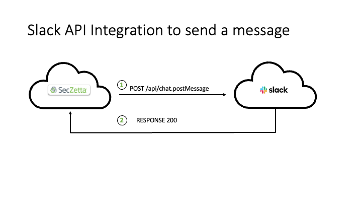

# SecZetta / Slack Integration

## Contents

- [SecZetta / Slack Integration]
  - [Overview](#overview)
    - [Architecture Overview](#architecture-overview)
  - [Supported Features](#supported-features)
  - [Prerequisites](#prerequisites)
  - [High Level Architecture](#High-Level-Architecture)
    - [API Integration](#API-Integration)
  - [Configuration Parameters](#Configuration-Parameters)
      - [Slack Configuration](#Slack-Configuration)
        - [Create a Slack Application and Obtain Authorization Token](#Create-a-Slack-Application-and-Obtain-Authorization-Token)
      -  [SecZetta Configuration](#SecZetta-Configuration)
        - [SecZetta Workflow Configuration to send a Slack Message](#SecZetta-Workflow-Configuration-to-send-a-Slack-Message)

## Overview

The main purpose of the SecZetta / Slack integration is:
- Notifications from SecZetta Life Cycle events to a slack channel and/or indiviual users.
- Planned enhancements for 2022 allows for other type integrations, as Slack will support deeper workflow integrations. For example we can initiate workflow approvals through slack versus or have the a workflow start in slack and have it fulfilled by SecZetta. 

## Supported Features

The SecZetta / Slack integration is configured as an REST API integration in a workflow versus an email notification.

## Prerequisites
- Slack:
  - Administrative access in Slack
  - Create an Application in Slack to obtain an authorization token (Bot or an Application token)
  - Create a manifest for the application with `chat.write` for the oauth scope
  - if you want to send message to channels the application needs to be added to the respective channel as an integration. Alternative you can add the following oauth scopes `chat:write.customize` and `chat:write.public` to the application permissions.
  - Install the application into the slack environment
  - Add the `user:read` Oauth scopes to the application to be able to read user information through an API call so you can store the value in the SecZetta People Profile   
- SecZetta
  - Create an attribute to store the Slack ID or Slack User name of the user (people profile)
  - Create a batch / automated workflow to obtain the slack id or user name from all relevant slack users and store it in the associated people profile  
  - Create a workflow to use the API call to send the message to a slack channel or slack user  

## High Level Architecture

### API Integration

 

## Configuration Parameters

This section provides the required configuration for the features described above:

### Slack Configuration
The application configuration requires Slack administrative accces to be able to execute the steps below. 

#### Create a Slack Application and Obtain Authorization Token
To obtain an authorization token that is used in a SecZetta workflow to send a slack message, go to the slack console to create a new application, located at https://api.slack.com/apps. Follow the steps below to create the new application:

- Click on the `Create New App` button:
- You can chose to either create the App from scratch or create it from an existing app manifest. The easier option is to use the manifest file that is stored in the Github respository for this integration. An example manifest file (YAML) is shown below:
<br>
_metadata:
  major_version: 1
  minor_version: 1
display_information:
  name: `SecZetta Integration`
features:
  bot_user:
    display_name: `SecZetta Bot`
    always_online: false
oauth_config:
  scopes:
    bot:
      - chat:write
      - chat:write.customize
      - chat:write.public
      - user:read
settings:
  org_deploy_enabled: false
  socket_mode_enabled: false
  token_rotation_enabled: false
<br>
The `name` field indicates the name of the application and the `display_name` is what shows up in the slack interface as the bot name, see below:


`Note:` You can add a logo if you like, but it needs to be between 512 and 2000 pixels and no larger than 16mb.

- Next you are asked about the slack workspace you want to develop your application in. Select the workspace you want to use. 
- Next you are shown a default app manifest file You can copy the content of the provided manifest file. Update the `name` and `display_name` fields if so desired and no application with the same name exists in the workspace. 
- Next you are shown a summary of the application oauth permissions and features and if these are correct, then press the `Create` button.
- Next you are shown the full manifest of the application in the Basic Information section of the application.
- Next go to the OAuth & Permission Section on the screen and a message appears that to get your token, you need to install the app into the workspace first. 
- Next install the application into the workdspace by selecting the button to do so.
- After the install is succesful, you see the `Bot User Oauth Token` displayed and you can use the `Copy` button to copy the token value as you need it for the configuration of the SecZetta workflow to send a Slack message. 

This concludes the slack configuration part.

### SecZetta Configuration
The configuration on the SecZetta side requires administrative accces to be able to configure a workflow to be used to send the slack message. 

#### SecZetta Workflow Configuration to send a Slack Message
Create a new `Create` workflow and select REST API as the only action in the workflow so it can be called from any other workflow.

To Configure the REST API parameters, use the folllowing table below:

Parameter | Description
--------- | --------------
BASIC SETTINGS |
Description | Provide a description of the REST API
AUTHENTICATION
Auth Type | None
REQUEST |
HTTP Verb | POST
End point | `https://slack.com/api/chat.postMessage`
Headers |
Content-Type | application/json; charset=utf-8
Authorization | Bearer Token Value
Json Body |
{
  "Text": "slack message to send",
  "channel": "slack channel name/id or slack username/id"  
}
RESPONSE |
Status Code Mapping | You may want to map the response code of the API
Data Mappings(s) | There is no need to 

Note: you can use liquid in both the text of the slack message and the channel as we have the slack user id stored in an SZ attribute. 

#### Example JSON using Liquid
The JSON example below shows an example on how to use liquid to send a slack message to the one execuing the workflow and informing them when the profile for the new people profile is created.

<br>`{
<br>    "text" : "Profile for  {{ profile.name }} has been created",
<br>    "channel" : "{{ attribute.slack_account_ne_attribute }}"
<br>}`


#### Profile Type ID

This `profile_type_id` is a value that will be specific to your profiles in your SecZetta environment. Find the id easily by following these steps:

1. Navigate your profile types page in the admin side of SecZetta. (Admin -> Lifecycle -> profile types
1. Select the profile type you want to import into SailPoint
1. Now in the URL you should be able to see the profile_type_id
    a. i.e. <your-seczetta-tenant>/neprofile_admin/profile_types/`687df53e-cdd8-4420-8431-ca6e62e81451`/basic_settings
1. Use that ID in place of <profile_type_id> above

#### Paging Details

The Paging steps listed above is a good working example to get started. If additional detail is needed refer to the Web Services Connector guide in the SailPoint documentation.

The main goal of the paging steps ‘code’ is to allow the web services connector to call SecZetta as many times as required to get the full list of active profiles

```
$sz_limit$ = 100
TERMINATE_IF $RECORDS_COUNT$ < $sz_limit$
$sz_offset$ = $sz_offset$ + $sz_limit$
$endpoint.fullUrl$ = $application.baseUrl$ + "/profiles?profile_type_id=<profile_type_id>&query[limit]=" + $sz_limit$ + "&query[offset]=" + $sz_offset$
```

Initially the limit of 100 would typically work. Sometimes however, the profiles in your SecZetta instances may be full of a large amount of attributes and additional data. In this case, you may want to lower that limit to ensure the API has enough time to download all the profile data without timing out. Play around with the limit variable above to meet your needs

### API Integration (SecZetta Initiated)

For this integration SecZetta will initiate the creation of identities using the /beta/non-employee-records API endpoint.

#### OAuth Client Creation

In the global settings, under security settings is ‘API Mangement’. On this page you are able to create a new OAuth Client by hitting the “+ New” button. Ensure that the client is for ‘Client Credentials’, ‘Refresh Token’, and ‘Authorization Code’. The screenshot below was taken in Q1 of 2021
 
Whenever you create your Client. Make sure to take not of the client_id and more importantly the client_secret. Those will be used to configure the REST API Action in SecZetta

Create a non-employee source (in IDN)

To utilize the API integration, IdentityNow needs to be setup with a non-employee source. You can do this by adding a new source connector. The Source Type for this connector will be ‘Non-employee’.

From here, the /beta/non-employee end point can be used to manage these identities


 
Get SourceID for non-employee Source

In order to create an Identity for the source that was created above. The /beta/non-employee endpoint requires a sourceId for the API call. The way to grab this sourceId is by using the same OAuth client above and calling the {{IDN_API_URL}}/beta/non-employee-sources endpoint.

If done successfully, the response should look very similar to this:

[
    {
        "id": "ac110006-76f4-1acc-8176-f85c7f9e000a",
        "sourceId": "2c91808876f477e60176f85c750b59a6",
        "name": "SecZetta NE",
        "description": "Non Employees From SecZetta",
        "approvers": [
            {
                "type": "IDENTITY",
                "id": "2c91808576774548017686132de3041f"
            }
        ],
        "accountManagers": [
            {
                "type": "IDENTITY",
                "id": "2c91808576774548017686132de3041f"
            }
        ],
        "created": "2021-01-12T20:49:40.26Z",
        "modified": "2021-01-12T20:50:26.823Z",
        "nonEmployeeCount": null
    }
]


Configuring the REST API Action

Within SecZetta, Create and Update workflows will make changes to the SecZetta profiles. These changes will likely result in an create/update required on the IdN side as well. This is where the REST API Action will come into play. Open whichever SecZetta workflow that needs to create an Identity cube and add a REST API Action. The following table shows the parameters required to make the API Action work correctly

Parameter | Description
--------- | --------------
Basic Settings &#8594; Description| 	Create or Update IDN Account
AuthN &#8594; Auth type	| OAuth2
AuthN &#8594; Access token URL | https://`<your-idn-tenant>`.api.identitynow.com/oauth/token

*Notice the api in the URL. That is required
AuthN  Client Id	Client_id for the OAuth Client created above
AuthN  Client secret	Client_secret for the Oauth Client created above
Request  Http verb	POST
Request  Endpoint	https://<your-idn-tenant>.api.identitynow.com/beta/non-employee-records
Request  Headers	Add 2 Headers:
1.	Content-Type = application/json
2.	Accept = */*
Request  Json body	This body will vary depending on the IDN configuration and schema. Here is an example

{
"accountName": "{{attribute.profile_uid_ne_attribute}}",
  "firstName": "{{attribute.personal_first_name}}",
  "lastName": "{{attribute.personal_last_name}}",
  "email": "{{attribute.personal_email}}",
  "phone": "{{attribute.phone_number}}",
  "manager": "john.doe",
  "sourceId": "2c91808876f477e60176f85c750b59a6",
  "data": {
      "riskscore": "6.92"
  },
  "startDate": 1610524800,
  "endDate": 1620892800
}

Notice the sourceId field that is required.

Response  Status Code Mapping	Map this status code to a SecZetta attribute. This will allow error handling within the workflow via conditionals

 

Response  Data Mapping(s)	The API response will contain the IdentityNow ID if the user was created successfully. Make sure to map that ID to a SecZetta attribute. This way during an update/delete, SecZetta will be able to update the identity correctly

 
